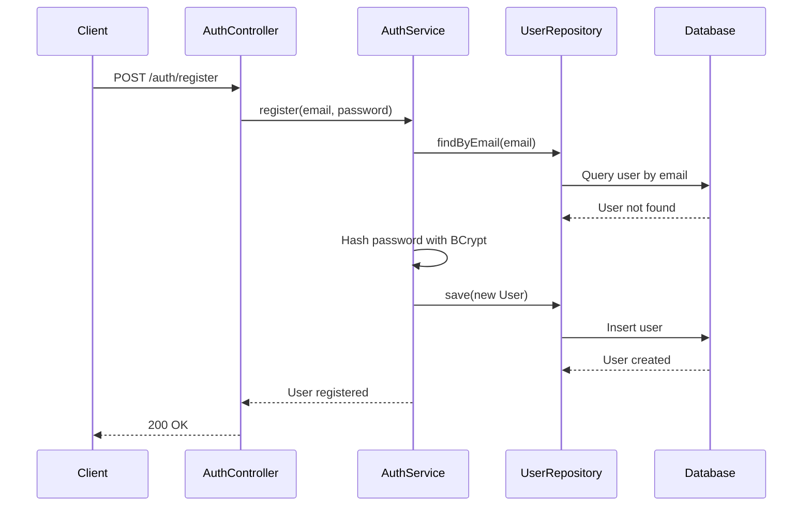
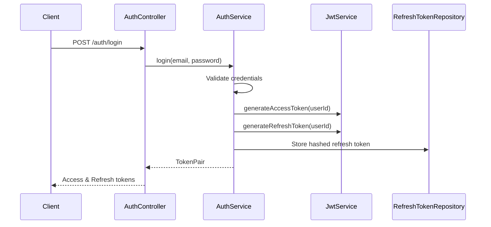
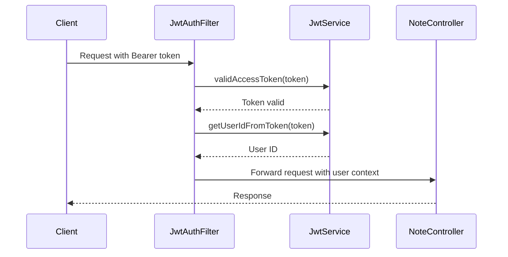

# Note App Backend Documentation

## Overview

The Note App is a RESTful backend service built with Spring Boot and Kotlin that provides secure note-taking functionality with user authentication. The application uses MongoDB for data persistence and JWT tokens for secure user authentication and authorization. Users can register, login, and manage their personal notes with full CRUD operations.

## Table of Contents

1. [Technology Stack](#technology-stack)
2. [Project Structure](#project-structure)
3. [API Endpoints](#api-endpoints)
4. [Authentication Flow](#authentication-flow)
5. [Database Schema](#database-schema)
6. [Security Implementation](#security-implementation)
7. [Configuration](#configuration)
8. [Getting Started](#getting-started)
9. [API Usage Examples](#api-usage-examples)
10. [Error Handling](#error-handling)
11. [Dependencies](#dependencies)

## Technology Stack

- **Backend Framework:** Spring Boot 3.5.3
- **Language:** Kotlin 1.9.25
- **Database:** MongoDB
- **Authentication:** JWT (JSON Web Tokens)
- **Security:** Spring Security
- **Password Hashing:** BCrypt
- **Build Tool:** Gradle with Kotlin DSL
- **Java Version:** 17

## Project Structure

```
src/
├── main/
│   ├── kotlin/com/ankit/note_app/
│   │   ├── controller/                     # REST Controllers
│   │   │   ├── AuthController.kt           # Authentication endpoints
│   │   │   ├── MainController.kt           # Main/health check endpoint
│   │   │   └── NoteController.kt           # Note CRUD operations
│   │   ├── database/                       # Database layer
│   │   │   ├── model/                      # Data models
│   │   │   │   ├── Note.kt                 # Note entity
│   │   │   │   ├── RefreshToken.kt         # Refresh token entity
│   │   │   │   └── User.kt                 # User entity
│   │   │   ├── repository/                 # Data access layer
│   │   │   │   ├── NoteRepository.kt       # Note repository
│   │   │   │   ├── RefreshTokenRepository.kt # Refresh token repository
│   │   │   │   └── UserRepository.kt       # User repository
│   │   │   └── security/                   # Security implementation
│   │   │       ├── AuthService.kt          # Authentication business logic
│   │   │       ├── HashedEncoder.kt        # Password hashing utility
│   │   │       ├── JwtAuthFilter.kt        # JWT authentication filter
│   │   │       ├── JwtService.kt           # JWT token management
│   │   │       └── SecurityConfig.kt       # Security configuration
│   │   ├── GlobalValidationHandler.kt      # Global exception handling
│   │   └── NoteAppApplication.kt           # Main application class
│   └── resources/
│       └── application.properties          # Application configuration
└── test/
    └── kotlin/com/ankit/note_app/
        └── NoteAppApplicationTests.kt      # Test configuration
```

## API Endpoints

### Authentication Endpoints

#### Register User
```http
POST /auth/register
Content-Type: application/json

{
  "email": "user@example.com",
  "password": "SecurePass123"
}
```

#### Login User
```http
POST /auth/login
Content-Type: application/json

{
  "email": "user@example.com",
  "password": "SecurePass123"
}
```

**Response:**
```json
{
  "accessToken": "eyJhbGciOiJIUzI1NiIsInR5cCI6IkpXVCJ9...",
  "refreshToken": "eyJhbGciOiJIUzI1NiIsInR5cCI6IkpXVCJ9..."
}
```

#### Refresh Token
```http
POST /auth/refresh
Content-Type: application/json

{
  "refreshToken": "eyJhbGciOiJIUzI1NiIsInR5cCI6IkpXVCJ9..."
}
```

### Note Endpoints

#### Create/Update Note
```http
POST /notes
Authorization: Bearer <access_token>
Content-Type: application/json

{
  "id": "optional_note_id",
  "title": "My Note Title",
  "content": "Note content here...",
  "color": 4294967295
}
```

#### Get All User Notes
```http
GET /notes
Authorization: Bearer <access_token>
```

#### Delete Note
```http
DELETE /notes/{note_id}
Authorization: Bearer <access_token>
```

### Health Check
```http
GET /
```

## Authentication Flow

The application implements a secure JWT-based authentication system with refresh tokens:

### 1. User Registration


### 2. User Login


### 3. Protected Request Flow


## Database Schema

### User Collection
```json
{
  "_id": "ObjectId",
  "email": "string (unique)",
  "hashedPassword": "string (BCrypt hashed)",
  "_class": "com.ankit.note_app.database.model.User"
}
```

### Note Collection
```json
{
  "_id": "ObjectId",
  "title": "string",
  "content": "string",
  "color": "number (Long)",
  "createdAt": "ISODate",
  "ownerId": "ObjectId (references User._id)",
  "_class": "com.ankit.note_app.database.model.Note"
}
```

### RefreshToken Collection
```json
{
  "_id": "ObjectId",
  "userId": "ObjectId (references User._id)",
  "expiresAt": "ISODate (TTL index)",
  "hashedToken": "string (SHA-256 hashed)",
  "createdAt": "ISODate",
  "_class": "com.ankit.note_app.database.model.RefreshToken"
}
```

## Security Implementation

### Password Security
- **Hashing Algorithm:** BCrypt with salt
- **Password Requirements:** 
  - Minimum 9 characters
  - At least one uppercase letter
  - At least one lowercase letter
  - At least one digit

### JWT Token Security
- **Access Token Expiry:** 15 minutes
- **Refresh Token Expiry:** 30 days
- **Algorithm:** HMAC SHA-256
- **Token Storage:** Refresh tokens are hashed with SHA-256 before database storage

### Security Configuration
```kotlin
@Configuration
class SecurityConfig {
    // CSRF disabled for stateless API
    // Session management: STATELESS
    // JWT filter applied before UsernamePasswordAuthenticationFilter
    // Public endpoints: /auth/**
    // All other endpoints require authentication
}
```

## Configuration

### Environment Variables
Create a `.env` file in the root directory:

```env
# Database Configuration
SPRING_DATA_MONGODB_URI=mongodb://localhost:27017/noteapp

# Server Configuration
PORT=8080

# JWT Configuration
JWT_SECRET_BASE64=your_base64_encoded_secret_key_here
```

### Application Properties
```properties
spring.application.name=note-app
server.port=${PORT}
spring.data.mongodb.uri=${SPRING_DATA_MONGODB_URI}
spring.data.mongodb.auto-index-creation=true
jwt.secret=${JWT_SECRET_BASE64}
```

## Getting Started

### Prerequisites
- Java 17 or higher
- MongoDB running locally or accessible via connection string
- Gradle (wrapper included)

### Installation Steps

1. **Clone the repository**
```bash
git clone <repository-url>
cd note-app
```

2. **Set up environment variables**
```bash
# Create .env file with required variables
cp .env.example .env
# Edit .env with your configuration
```

3. **Generate JWT Secret**
```bash
# Generate a base64 encoded secret key
echo -n "your-256-bit-secret-key-here" | base64
```

4. **Start MongoDB**
```bash
# Using Docker
docker run -d -p 27017:27017 --name mongodb mongo:latest

# Or start your local MongoDB instance
mongod
```

5. **Build and run the application**
```bash
# Build the project
./gradlew build

# Run the application
./gradlew bootRun
```

6. **Verify the application**
```bash
curl http://localhost:8080/
# Should return: "This is the main Page for Note App"
```

## API Usage Examples

### Complete User Flow

#### 1. Register a new user
```bash
curl -X POST http://localhost:8080/auth/register \
  -H "Content-Type: application/json" \
  -d '{
    "email": "john@example.com",
    "password": "SecurePass123"
  }'
```

#### 2. Login to get tokens
```bash
curl -X POST http://localhost:8080/auth/login \
  -H "Content-Type: application/json" \
  -d '{
    "email": "john@example.com",
    "password": "SecurePass123"
  }'
```

#### 3. Create a note
```bash
curl -X POST http://localhost:8080/notes \
  -H "Authorization: Bearer YOUR_ACCESS_TOKEN" \
  -H "Content-Type: application/json" \
  -d '{
    "title": "Meeting Notes",
    "content": "Discuss project timeline and requirements",
    "color": 4294967295
  }'
```

#### 4. Get all notes
```bash
curl -X GET http://localhost:8080/notes \
  -H "Authorization: Bearer YOUR_ACCESS_TOKEN"
```

#### 5. Delete a note
```bash
curl -X DELETE http://localhost:8080/notes/NOTE_ID \
  -H "Authorization: Bearer YOUR_ACCESS_TOKEN"
```

#### 6. Refresh access token
```bash
curl -X POST http://localhost:8080/auth/refresh \
  -H "Content-Type: application/json" \
  -d '{
    "refreshToken": "YOUR_REFRESH_TOKEN"
  }'
```

## Error Handling

### Global Exception Handler
The application includes comprehensive error handling:

```kotlin
@RestControllerAdvice
class GlobalValidationHandler {
    // Handles validation errors
    // Returns structured error responses
    // HTTP 400 for validation failures
}
```

### Common Error Responses

#### Validation Error (400)
```json
{
  "errors": [
    "Invalid email format.",
    "Password must be at least 9 characters long and contain at least one digit, uppercase and lowercase character."
  ]
}
```

#### Authentication Error (401)
```json
{
  "timestamp": "2024-01-15T10:30:00.000+00:00",
  "status": 401,
  "error": "Unauthorized",
  "path": "/notes"
}
```

#### User Already Exists (409)
```json
{
  "timestamp": "2024-01-15T10:30:00.000+00:00",
  "status": 409,
  "error": "Conflict",
  "message": "A user with that email already exists."
}
```

## Dependencies

### Core Dependencies
```kotlin
dependencies {
    // Spring Boot Starters
    implementation("org.springframework.boot:spring-boot-starter-web")
    implementation("org.springframework.boot:spring-boot-starter-data-mongodb")
    implementation("org.springframework.boot:spring-boot-starter-security")
    implementation("org.springframework.boot:spring-boot-starter-validation")
    
    // Kotlin Support
    implementation("org.jetbrains.kotlin:kotlin-reflect")
    implementation("org.jetbrains.kotlinx:kotlinx-coroutines-reactor")
    implementation("io.projectreactor.kotlin:reactor-kotlin-extensions")
    
    // JWT Implementation
    implementation("io.jsonwebtoken:jjwt-api:0.12.6")
    runtimeOnly("io.jsonwebtoken:jjwt-impl:0.12.6")
    runtimeOnly("io.jsonwebtoken:jjwt-jackson:0.12.6")
    
    // Security
    implementation("org.springframework.security:spring-security-crypto")
    
    // Environment Configuration
    implementation("io.github.cdimascio:dotenv-kotlin:6.5.1")
    
    // Servlet API
    compileOnly("jakarta.servlet:jakarta.servlet-api:6.1.0")
}
```

### Testing Dependencies
```kotlin
testImplementation("org.springframework.boot:spring-boot-starter-test")
testImplementation("io.projectreactor:reactor-test")
testImplementation("org.jetbrains.kotlin:kotlin-test-junit5")
testImplementation("org.jetbrains.kotlinx:kotlinx-coroutines-test")
testImplementation("org.springframework.security:spring-security-test")
```

## Development Guidelines

### Code Style
- Follow Kotlin coding conventions
- Use data classes for DTOs and entities
- Implement proper validation on all endpoints
- Use sealed interfaces for events/states when applicable

### Security Best Practices
- Never store plain text passwords
- Always validate and sanitize user input
- Use HTTPS in production
- Implement proper CORS configuration for frontend integration
- Log security events for monitoring

### Database Best Practices
- Use MongoDB TTL indexes for time-based data expiry
- Implement proper indexing for query performance
- Use ObjectId for primary keys
- Implement proper error handling for database operations

### API Design
- Follow RESTful principles
- Use appropriate HTTP status codes
- Implement consistent error response format
- Version your APIs for future compatibility
- Document all endpoints with proper examples

---

**Note:** This documentation serves as a comprehensive guide for understanding and working with the Note App backend. For production deployment, ensure proper security configurations, monitoring, and backup strategies are implemented.
